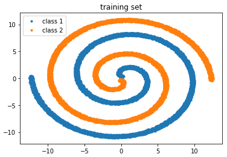

# Supervised learning
## Classification made with scikit-learn models

###### Prediction is made in Jupyter notebooks. The purpose of the project is to make basic classification on two spiral data and show, how different models can deal with it.

## Models included
##### -Decision tree
##### -K-nearest neighbors
##### -Logistic regression
##### -Neural network
##### -Support vector machine

## Created dataset

